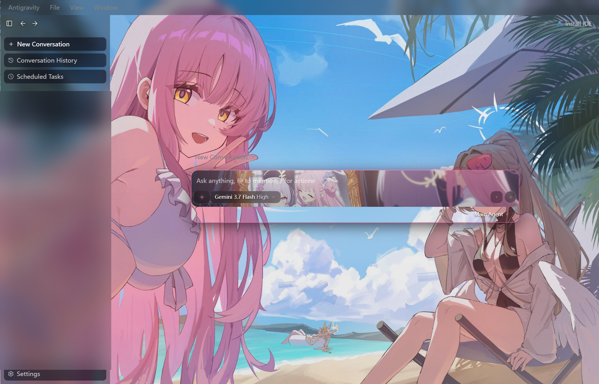
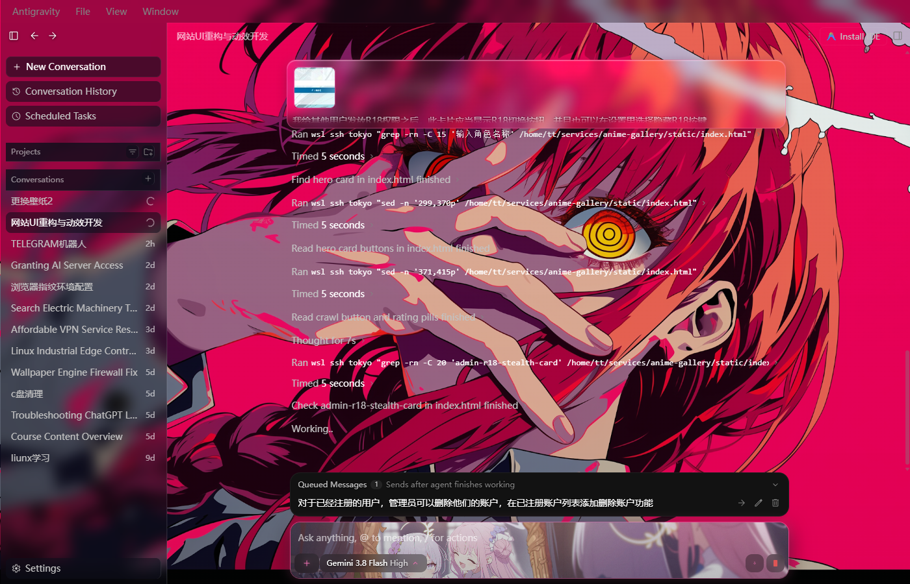
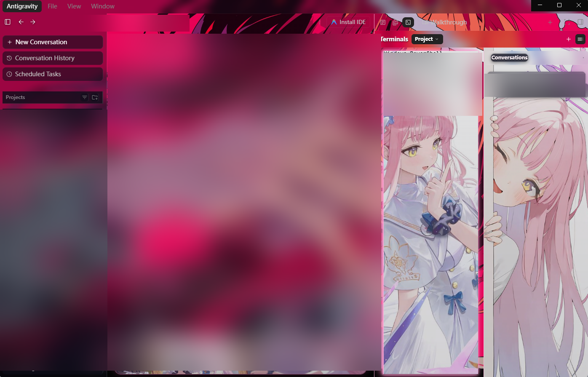

# 🌸 Antigravity Theme Customizer

<p align="center">
  
</p>

<p align="center">
  <a href="https://nodejs.org/"></a>
  <a href="https://www.electronjs.org/"></a>
  <a href="https://github.com/krantjohn/antigravity-theme/blob/main/LICENSE"></a>
  <a href="https://github.com/krantjohn/antigravity-theme"></a>
  <a href="https://github.com/krantjohn/antigravity-theme"></a>
  <a href="https://github.com/krantjohn/antigravity-theme/stargazers"></a>
</p>

<p align="center">
  <b>让你的 Google Antigravity 客户端焕然一新！</b><br>
  专为 Google Antigravity 打造的高性能、全透光、5 槽位独立二次元沉浸式主题引擎。<br>
  <i>支持 60FPS 动态视频流媒体、Steam Wallpaper Engine 创意工坊直连、自适应发光字体与一键预设切换。</i>
</p>

---

## 🌟 为什么选择 Antigravity Theme Customizer？

传统的官方客户端界面非黑即白、结构单调，无法展现你喜欢的动漫角色或动态美学。而本主题引擎彻底解决了这一痛点：

| 痛点 | 传统美化方式 | 🌸 本主题引擎解决方案 |
| :--- | :--- | :--- |
| **动态视频支持** | 仅支持静态图片，视频导致客户端卡死 | **内置 RFC 7233 流媒体服务器**，HTTP 206 毫秒级流式分块，60FPS 极致丝滑 |
| **能耗与显存** | 无论前后台后台始终满载解码，GPU 显存暴涨 | **GPU 智能视口感知休眠**：抽屉折叠、终端关闭或最小化时**毫秒级自动暂停解码**，展开即时复播 |
| **素材获取** | 手动到处找图、裁剪分辨率 | **Steam Wallpaper Engine 深度直连**：自动跨盘扫描创意工坊订阅库，一键装配到任意槽位 |
| **字迹辨识度** | 换浅色/高对比壁纸后文字被吞，看不清代码 | **全界面自适应字体引擎**：内置 6 套发光轮廓预设或任意 Hex，根据明暗感知自动计算微光描边 |
| **多区域协同** | 全局千篇一律一张图，终端和对话互相干扰 | **5 大独立壁纸槽位**：主对话底图、PowerShell 终端、会话抽屉、输入框、设置弹窗分区独立配置 |
| **多套风格管理** | 换一套壁纸要到处找旧文件，极易丢失 | **独立预设管理器**：全套配置 + 素材全量实体归档，一键 0.3 秒无缝热重载切换 |
| **官方升级失效** | 官方一推送小更新，所有美化直接报废 | **官方 v2.13.0 深度兼容 + 防静默回滚保护**：支持自动重新注入，并拦截后台无感覆盖 |

---

## 📸 视觉效果实测 (Showcase)

| 圣园未花柔光樱粉 (默认典藏) | 玛奇玛手势支配 (自定义换装) | 三面板独立联动工作流 (实战多任务) |
| :---: | :---: | :---: |
|  |  |  |

<p align="center">
  
  <br>
  <em>✨ 三面板独立壁纸实战：左侧 AI 主对话区（全景底图） + 中间 PowerShell 终端（专属终端壁纸） + 右侧会话抽屉（独立侧栏壁纸）</em>
</p>

---

## 🧩 五大独立壁纸槽位设计体系 (Mental Model)

本引擎通过精密的 DOM 隔离与 CSS 选择器穿透，将 Antigravity 划分为 5 个完全独立的视觉槽位，彼此互不渗透：

```text
┌────────────────────────────────────────────────────────────────────────┐
│ [Top Menu] Antigravity   File   View   Window             [— ▢ ✕]      │
├───────────────┬──────────────────────────┬─────────────────────────────┤
│               │                          │                             │
│   【左】槽位   │        【中】槽位         │          【右】槽位          │
│               │                          │                             │
│  AI 主对话区   │   PowerShell 终端面板    │       右侧会话抽屉侧栏       │
│  (全局贯穿底图) │   (.terminal.xterm)      │     (Conversations Drawer)  │
│               │                          │                             │
├───────────────┴──────────────────────────┴─────────────────────────────┤
│                 【下】槽位: 底部提问输入框卡片 (Prompt Card)             │
└────────────────────────────────────────────────────────────────────────┘
  【设置】槽位: 设置弹窗独立插画 (Settings Modal Backdrop)
```

| 槽位代号 | 英文标识 | 对应界面区域 | 推荐素材类型 | 视觉设计与交互职责 |
| :---: | :---: | :--- | :---: | :--- |
| **`左`** | `left` | **全局主对话背景** | 1080P/2K/4K 动态视频 (MP4) | 整个应用的贯通底座，透出主对话流与全局透明磨砂玻璃层 |
| **`中`** | `mid` | **活跃终端面板** | 动态视频 / 高清原画 | 专属 PowerShell / Bash 终端界面，写代码与跑测试时沉浸式专享 |
| **`右`** | `right` | **独立会话抽屉** | 竖版立绘 / 场景动态图 | 点击侧边栏展开会话列表（Conversations）抽屉时独立呈现，不污染总览面板 |
| **`下`** | `bottom` | **提问输入框** | 动漫局部特写 / GIF / 微动态 | 底部聊天提问框内部卡片背景，伴随每一次灵感输入 |
| **`设置`** | `settings`| **设置弹窗** | 专属插画 (PNG/JPG) | 点击左下角 Settings 弹出的设置面板背景，典雅美观 |

---

## 🚀 30 秒极速上手 (Quick Start)

### 前置要求
- **操作系统**：Windows 10 / 11 (64-bit)
- **运行环境**：已安装 [Node.js](https://nodejs.org/) (推荐 LTS v16 及以上)
- **客户端**：已安装 Google [Antigravity](https://antigravity.google/) (已完全适配 v2.13.0+)

### 一键安装

1. **克隆本仓库到本地**：
   ```bash
   git clone https://github.com/krantjohn/antigravity-theme.git
   cd antigravity-theme
   ```

2. **运行一键自动安装脚本**：
   - 直接双击运行 **`bin/install.bat`**。
   - 脚本会自动执行：
     1. 编译全套主题样式表并配置本地流媒体服务；
     2. 解包客户端核心包并自动注入 GPU 硬件加速开关、CDP 热重载端口与渲染引擎；
     3. 注入顶部菜单栏层级保障与防碰撞自适应逻辑；
     4. 固化核心并拉起全新二次元界面的 Antigravity！

---

## 🎮 自由更换壁纸与预设管理 (Wallpapers & Presets)

### 选项 A：使用全中文交互式批处理控制台（推荐）

直接双击运行 **`bin/swap_wallpaper.bat`**，控制台提供直观的一键菜单：

```text
=====================================================
   🌸 Antigravity Theme Customizer —— 壁纸与预设管理
=====================================================
  [1] 更换本地壁纸 (拖入 MP4 视频或 JPG/PNG 图片)
  [2] 浏览 Steam Wallpaper Engine 创意工坊已订阅壁纸
  [3] 搜索 Steam Wallpaper Engine 壁纸并一键装配
  [4] 自定义全界面字体颜色 (内置 6 套自适应抗眩光预设)
  [5] 查看当前 5 大槽位壁纸状态与字体配置
  [6] 🗂️ 进入预设管理中心 (保存当前全套配置 / 一键秒切预设)
  [0] 退出
=====================================================
```

---

### 选项 B：命令行一键指令 (CLI Commands)

所有操作均支持直接在终端中以一条命令极速执行，并通过 CDP 触发 **0.3 秒无感热重载**（无需重启应用）：

#### 1. Steam Wallpaper Engine 创意工坊壁纸（跨盘直连）
```bash
# 扫描并列出所有已订阅的 Wallpaper Engine 壁纸
node core/theme_engine.js --list-we

# 关键词搜索工坊壁纸 (例如搜索包含 "碧蓝" 或 "原神" 的壁纸)
node core/theme_engine.js --list-we "碧蓝"

# 按序号或创意工坊 ID 一键应用到指定槽位 (例如将序号 2 应用到全局底图)
node core/theme_engine.js --swap-we 2 左

# 用工坊 ID 直接应用到中间终端面板
node core/theme_engine.js --swap-we 3164111930 中
```

#### 2. 本地文件直接更换 (支持视频与图片)
```bash
# 将【左槽位 (全局主背景)】更换为任意本地动态视频
node core/theme_engine.js --swap "左" "D:\Media\dania_4k.mp4"

# 将【中槽位 (终端背景)】更换为本地静态壁纸
node core/theme_engine.js --swap "中" "D:\Pictures\terminal_bg.png"

# 将【下槽位 (输入框)】更换为动图
node core/theme_engine.js --swap "下" "D:\Media\input_art.gif"

# 查看当前 5 大槽位及字体颜色状态
node core/theme_engine.js --status
```

#### 3. 自定义全界面字体颜色 (告别反光与看不清)
```bash
# 查看所有内置高对比字体预设
node core/theme_engine.js --list-font-colors

# 切换为暗夜曜黑 (适合纯白/超亮动漫壁纸，曜黑字体搭配白辉光描边，绝不刺眼)
node core/theme_engine.js --font obsidian-black

# 切换为纯白高对比 / 樱花粉 / 赛博青
node core/theme_engine.js --font pure-white
node core/theme_engine.js --font sakura-pink
node core/theme_engine.js --font cyber-cyan

# 输入任意 Hex 颜色值 (自动感知明暗亮度，并生成微米级发光阴影)
node core/theme_engine.js --font "#ff79c6"
```

#### 4. 预设归档与一键秒级切换 (Preset Manager)
```bash
# 将当前 5 个槽位的配置、显示坐标与实体视频/图片文件完整保存并归档
node core/theme_engine.js --save-preset "赛博朋克风" "4K雨夜霓虹多视频协同"

# 查看所有已归档的预设列表与占用体积
node core/theme_engine.js --list-presets

# 查看某套预设的详细槽位素材信息
node core/theme_engine.js --show-preset "赛博朋克风"

# 0.3 秒一键切换并激活指定预设 (所有素材自动恢复，免重启生效)
node core/theme_engine.js --apply-preset "赛博朋克风"

# 删除不需要的预设
node core/theme_engine.js --delete-preset "旧配置"
```

#### 5. 一键恢复官方原版纯净模式 (Restore Official Vanilla)
```bash
# 一键恢复官方原生模式 (自动安全快照备份当前个性化配置，彻底卸载视频解码器并清空自定义样式)
node core/theme_engine.js --restore-original

# 快捷脚本：直接双击运行 bin/restore_original.bat 或 bin/一键恢复官方原版.bat
# 随时无损切回壁纸：node core/theme_engine.js --apply-preset "恢复原版前的个性化配置"
```

---

## ⚙️ 核心架构与技术实现 (Architecture Deep Dive)

```text
┌─────────────────────────────────────────────────────────────────────────────┐
│                             Electron 宿主主进程                              │
│  [main.js] 开启 CDP 8314 调试端口 ──启动──> [media_server.js] 本地流媒体服务 (8315)  │
└──────────────────────────────────────┬──────────────────────────────────────┘
                                       │ HTTP 206 视频流 / CSS 热加载
┌──────────────────────────────────────▼──────────────────────────────────────┐
│                            Chromium 渲染进程界面                             │
│  [preload.js] 注入 0ms 占位底图 ──挂载──> <video data-slot="left/mid/right"> │
│  [IntersectionObserver] 智能休眠 ──探测──> 可视即播 / 隐藏即停 (GPU 节能)     │
│  [custom_theme.css] 穿透注入 ───────> 磨砂玻璃、自适应字体发光、菜单栏 Z-Index │
└─────────────────────────────────────────────────────────────────────────────┘
```

1. **RFC 7233 规范流媒体服务器 (`core/media_server.js`)**：
   - 监听本地端口 `8315`，原生支持 HTTP 206 Partial Content 分块传输；
   - 引入容量为 200 的 LRU 文件定位缓存与 3 秒 TTL 的状态缓存，彻底消除分块请求重复读取磁盘的 I/O 阻塞；
   - 智能绑定连接生命周期（`keepAliveTimeout`），杜绝 Electron 多次创建 video 标签时的句柄泄漏。
2. **GPU 智能解码休眠机制 (`preload.js` / `core/auto_patcher.js`)**：
   - 传统视频壁纸即使在抽屉收起、终端隐藏时仍由 Chromium 后台解码，极度浪费显存与能耗；
   - 本引擎内置毫秒级可见性探针：当辅助面板折叠、终端切换为其他标签页或客户端最小化时，**自动调用 `.pause()` 暂停解码**；当用户重新展开该区域时，**即时调用 `.play()` 无感恢复播放**。
3. **顶级堆叠上下文保障 (`titlebarFix`)**：
   - 彻底修复官方更新后由于容器定位导致的 `Antigravity`、`File`、`View`、`Window` 顶部原生菜单被主工作区覆盖的 Bug；
   - 将菜单栏提升至顶级 Stacking Context（`z-index: 9000`），并赋予下拉菜单奢华的暗夜亚克力磨砂背景（`blur(20px)` + `rgba(22, 24, 34, 0.94)`），点击响应丝滑。
4. **防静默更新拦截盾 (`core/auto_patcher.js`)**：
   - 智能接管官方 `electron-updater` 配置，将后台无感静默下载与强行重启安装切换为受控模式，再也不用担心辛辛苦苦调好的美化突然被官方自动抹除。

---

## 🛡️ 安全合规与隐私保障 (Security & Privacy)

很多同学关心使用客户端美化是否有封号或隐私风险，本项目郑重承诺：

- 🔒 **100% 纯本地前端渲染定制**：
  所有视觉变换均发生在你本地电脑的 Chromium 视图渲染层，类似于在 Chrome 浏览器中安装 Stylus 扩展。
- 🚫 **绝对零网络协议侵入**：
  **不拦截、不修改、不转发**任何与 Google AI 服务器交互的网络请求、API 接口与认证 Token。
- 👤 **零个人隐私泄露**：
  代码开源且经过严格审计，开源仓库绝不搜集或上传你的任何壁纸文件、本地路径或个人标识。

---

## 📂 仓库目录全貌 (Project Structure)

```text
antigravity-theme/
├── bin/
│   ├── install.bat             # 一键自动安装与底层永久固化引导程序
│   ├── preset_manager.bat      # 预设管理中心 (一键保存当前全套配置/归档/秒切预设/恢复原版)
│   ├── swap_wallpaper.bat      # 综合壁纸与字体交互式管理控制台
│   ├── wallpaper_engine.bat    # Steam Wallpaper Engine 专属工坊壁纸提取选择器
│   ├── restore_baseline.bat    # 一键还原为初始静态二次元基线
│   ├── restore_original.bat    # 🛡️ 一键恢复为官方原版纯净模式 (零壁纸/零解码/自动安全快照)
│   └── 一键恢复官方原版.bat    # 中文命名快捷入口脚本
├── core/
│   ├── theme_engine.js         # 核心主题编译器：CSS 生成、5 槽位控制、CDP 0.3s 热重载
│   ├── wallpaper_engine_bridge.js # Steam 跨盘符库自动发现与创意工坊 VDF/JSON 资产解析
│   ├── media_server.js         # 高性能流媒体微服务：HTTP Range 206 分块、LRU 缓存
│   └── auto_patcher.js         # 核心补丁引擎：自动化解包 asar、注入主进程/渲染进程、固化
├── wallpapers/                 # 默认预设壁纸素材 (未花、普拉娜、妃咲等高颜值原画)
├── assets/                     # 文档图文与演示预览素材
├── tests/                      # 端到端自动化测试套件 (流媒体性能、CDP 热重载、预设与原版还原测试)
├── LICENSE                     # MIT 开源授权协议
└── README.md                   # 项目官方使用手册
```

---

## 💡 常见问题 (FAQ)

<details>
<summary><b>Q1: 遇到 Antigravity 官方发布版本更新怎么办？</b></summary>
不用慌张！你的壁纸素材与保存的预设保存在用户独立目录中，<b>绝不会丢失</b>。<br>
在 Antigravity 更新后，只需要双击运行一次 <code>bin/install.bat</code>，引擎会自动解包官方最新核心包，将主题引擎与防回滚保护重新注入固化，整个过程仅需 10 秒。
</details>

<details>
<summary><b>Q2: 使用动态视频壁纸会导致电脑发热或占用显卡吗？</b></summary>
不会。本引擎采用 Chromium 底层硬件加速，并独家配备了“GPU 可视性休眠引擎”：当终端收起、会话列表收起或窗口最小化时，不可见视频会自动暂停解码，显存与 CPU 占用几乎归零。
</details>

<details>
<summary><b>Q3: 更换了很亮的纯白壁纸，界面文字看不太清怎么办？</b></summary>
运行 <code>bin/swap_wallpaper.bat</code> 选择 <code>[5] 自定义字体颜色</code>，选择 <code>[2] 暗夜曜黑 (obsidian-black)</code> 预设，或在终端输入 <code>node core/theme_engine.js --font obsidian-black</code>。文字将自动切换为高对比深色并附带柔和白辉光微轮廓，即使在超亮纯白背景上依然清晰锐利。
</details>

<details>
<summary><b>Q4: 如何一键恢复为官方原版或彻底卸载？</b></summary>
直接双击运行 <code>bin/restore_original.bat</code>（或 <code>bin/一键恢复官方原版.bat</code>），系统会自动为当前的个性化配置建立安全快照预设，并在 0.3 秒内清空所有自定义样式与视频解码器，恢复纯正官方深色原生外观与极致流畅性能；随时可一键恢复个性化壁纸。
</details>

---

## 🤝 参与贡献 (Contributing)

欢迎提交 Issue 和 Pull Request！如果你调试出了好看的流光渐变、定制预设或发现了新的兼容性优化点，欢迎与社区一同分享！

- ⭐️ 如果这个项目让你的 Antigravity 赏心悦目，欢迎给本仓库点一个 **Star** 支持作者！

---

## 📜 开源协议 (License)

本项目基于 [MIT License](LICENSE) 协议开源。<br>
默认附带的演示壁纸素材版权归原画师及蔚蓝档案 (Blue Archive) / 对应官方所有，仅供个人学习与审美交流使用。

