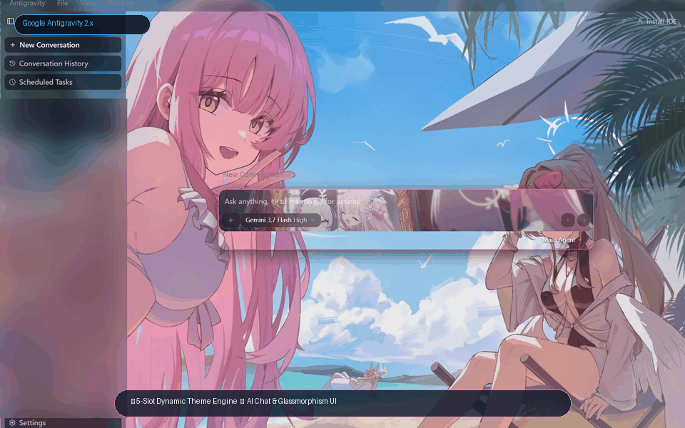
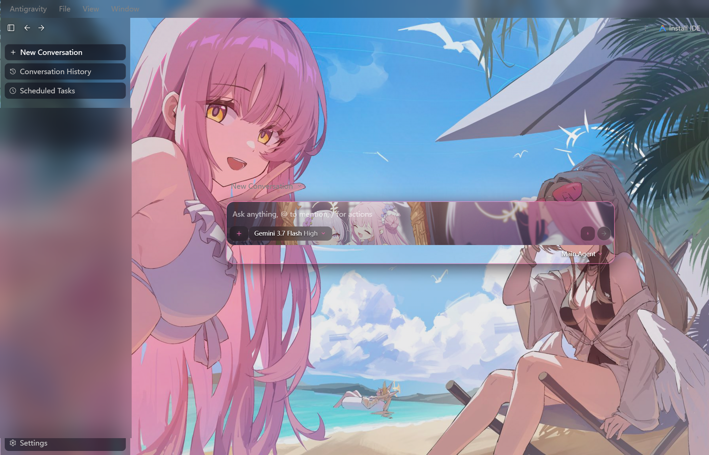
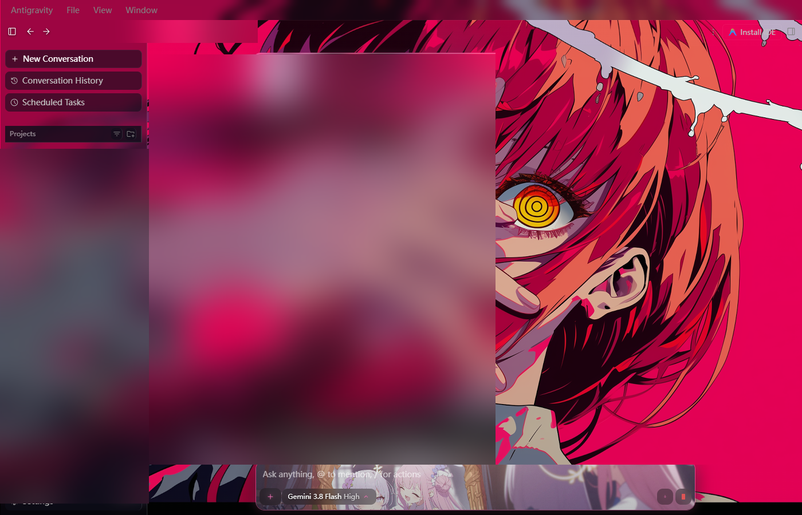
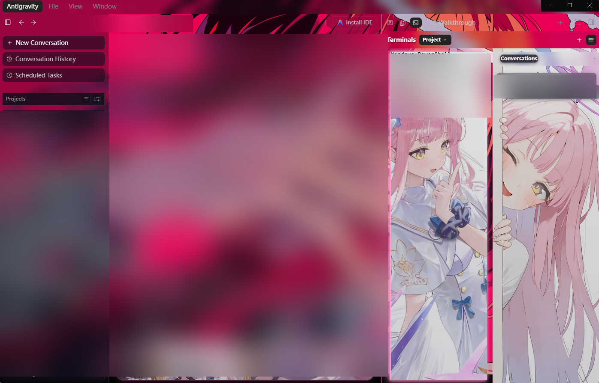

# 🌸 Antigravity Theme Customizer

<p align="center">
  
</p>

<p align="center">
  <a href="README_EN.md"></a>
  <a href="README.md"></a>
  <a href="https://github.com/krantjohn/antigravity-theme/releases"></a>
  <a href="https://nodejs.org/"></a>
  <a href="https://www.electronjs.org/"></a>
  <a href="LICENSE"></a>
  <a href="https://github.com/krantjohn/antigravity-theme/stargazers"></a>
</p>

<p align="center">
  <b>让你的 Google Antigravity 客户端焕然一新！</b><br>
  专为 Google Antigravity 打造的高性能、全透光、5 槽位独立二次元沉浸式主题引擎。<br>
  <i>支持 60FPS 动态流媒体壁纸、Steam Wallpaper Engine 创意工坊直连、自适应发光字体与一键预设秒切。</i>
</p>

---

## 🌟 核心特性与设计优势

传统的官方客户端界面结构单调，缺少个性化美学表达。Antigravity Theme Customizer 提供了一整套完整、轻量且可控的现代化美化方案：

| 维度 | 传统美化方式 | 🌸 本主题引擎解决方案 |
| :--- | :--- | :--- |
| **动态视频流媒体** | 仅支持静态图片，视频易导致客户端卡死 | **内置 RFC 7233 流媒体微服务**：HTTP 206 毫秒级分块流式传输，60FPS 丝滑回放 |
| **能耗与显存控制** | 无论前后台始终满载解码，显存与能耗飙升 | **智能视口感知休眠**：抽屉折叠、终端关闭或最小化时**自动暂停解码**，展开即时复播 |
| **素材获取与联动** | 手动寻找壁纸、裁剪分辨率与转换格式 | **Steam Wallpaper Engine 跨盘直连**：自动扫描创意工坊订阅库，一键装配到指定槽位 |
| **字迹辨识与抗眩光** | 浅色/高对比壁纸下文字泛白，看不清代码 | **全界面自适应字体引擎**：内置 6 套发光轮廓预设或任意 Hex，自动计算对比度微光描边 |
| **多区域独立布局** | 全局千篇一律一张图，终端和对话互相干扰 | **5 大独立壁纸槽位**：主对话底图、PowerShell 终端、会话抽屉、输入框、设置弹窗分区独立配置 |
| **全套配置预设化** | 更换壁纸易丢失历史调配好的素材 | **独立预设管理器**：全套配置 + 素材全量实体归档，一键 0.3 秒无缝热重载切换 |
| **升级覆盖与备份保护**| 官方推送更新后所有美化直接报废 | **官方核心物理备份 (`app.asar.orig.bak`)**：安全隔离原版，支持一键出厂级彻底还原 |

---

## 📸 视觉效果实测 (Showcase)

| 圣园未花柔光樱粉 (默认典藏) | 玛奇玛手势支配 (自定义换装) | 三面板独立联动工作流 (实战多任务) |
| :---: | :---: | :---: |
|  |  |  |

<p align="center">
  
  <br>
  <em>✨ 三面板独立壁纸实战：左侧 AI 主对话区（全景底图） + 中间 PowerShell 终端（专属终端壁纸） + 右侧会话抽屉（独立侧栏壁纸）</em>
</p>

---

## 🧩 五大独立壁纸槽位设计体系 (Mental Model)

本引擎通过精密的 DOM 隔离与 CSS 选择器穿透，将 Antigravity 划分为 5 个完全独立的视觉槽位，彼此互不渗透：

```text
┌────────────────────────────────────────────────────────────────────────┐
│ [Top Menu] Antigravity   File   View   Window             [— ▢ ✕]      │
├───────────────┬──────────────────────────┬─────────────────────────────┤
│               │                          │                             │
│   【左】槽位   │        【中】槽位         │          【右】槽位          │
│               │                          │                             │
│  AI 主对话区   │   PowerShell 终端面板    │       右侧会话抽屉侧栏       │
│  (全局贯穿底图) │   (.terminal.xterm)      │     (Conversations Drawer)  │
│               │                          │                             │
├───────────────┴──────────────────────────┴─────────────────────────────┤
│                 【下】槽位: 底部提问输入框卡片 (Prompt Card)             │
└────────────────────────────────────────────────────────────────────────┘
  【设置】槽位: 设置弹窗独立插画 (Settings Modal Backdrop)
```

| 槽位代号 | 英文标识 | 对应界面区域 | 推荐素材类型 | 视觉设计与交互职责 |
| :---: | :---: | :--- | :---: | :--- |
| **`左`** | `left` | **全局主对话背景** | 1080P/2K/4K 动态视频 (MP4) | 贯通整个应用的底层基底，透出对话气泡与全局磨砂玻璃层 |
| **`中`** | `mid` | **活跃终端面板** | 动态视频 / 高清原画 | 专属 PowerShell / Bash 终端界面，写代码与跑测试时沉浸式专享 |
| **`右`** | `right` | **独立会话抽屉** | 竖版立绘 / 场景动态图 | 点击侧边栏展开会话列表（Conversations）抽屉时独立呈现，不污染总览面板 |
| **`下`** | `bottom` | **提问输入框** | 动漫局部特写 / GIF / 微动态 | 底部聊天提问框内部卡片背景，伴随每一次灵感输入 |
| **`设置`** | `settings`| **设置弹窗** | 专属插画 (PNG/JPG) | 点击左下角 Settings 弹出的设置面板背景，典雅美观 |

---

## 🚀 快速上手 (Quick Start)

### 前置要求
- **操作系统**：Windows 10 / 11 (64-bit)
- **运行环境**：已安装 [Node.js](https://nodejs.org/) (推荐 LTS v18+)
- **客户端**：已安装 Google [Antigravity](https://antigravity.google/) (已完全适配最新版)

---

### 方式 1：使用 Theme Studio 可视化工作台（推荐）

本仓库提供两种使用 Theme Studio 可视化工作台的方式：

#### 方案 A：从 GitHub Releases 下载预编译客户端（免配置）
1. 前往 **[Releases 页面](https://github.com/krantjohn/antigravity-theme/releases)** 下载最新的 `AntigravityThemeStudio.exe`；
2. 放置到项目根目录或任意目录直接双击打开，即可体验 1:1 实时拟真预览、工坊壁纸拖拽与一键热重载。

#### 方案 B：直接通过源码启动（纯开源、零二进制依赖）
如果你希望不运行任何外部 `.exe`，推荐直接以纯源码方式启动：
```bash
# 1. 克隆代码仓库
git clone https://github.com/krantjohn/antigravity-theme.git
cd antigravity-theme

# 2. 启动可视化工作台服务
node studio/launcher.js
# 或运行快捷批处理：dev\bin\start_studio.bat
```
浏览器将自动以极简无边框应用模式唤起 `Theme Studio` 控制台。

---

### 方式 2：使用 CLI 批处理菜单

双击运行 **`dev/bin/swap_wallpaper.bat`**，控制台提供直观的全中文菜单：

```text
=====================================================
   🌸 Antigravity Theme Customizer —— 壁纸与预设管理
=====================================================
  [1] 更换本地壁纸 (拖入 MP4 视频或 JPG/PNG 图片)
  [2] 浏览 Steam Wallpaper Engine 创意工坊已订阅壁纸
  [3] 搜索 Steam Wallpaper Engine 壁纸并一键装配
  [4] 自定义全界面字体颜色 (内置 6 套自适应抗眩光预设)
  [5] 查看当前 5 大槽位壁纸状态与字体配置
  [6] 🗂️ 进入预设管理中心 (保存当前全套配置 / 一键秒切预设)
  [0] 退出
=====================================================
```

---

### 方式 3：命令行一键指令 (CLI Commands)

所有操作均支持直接在终端中以一条命令极速执行，并通过 CDP 触发 **0.3 秒无感热重载**（无需重启应用）：

#### 1. Steam Wallpaper Engine 创意工坊壁纸（跨盘直连）
```bash
# 扫描并列出所有已订阅的 Wallpaper Engine 壁纸
node core/theme_engine.js --list-we

# 关键词搜索工坊壁纸
node core/theme_engine.js --list-we "碧蓝"

# 按序号一键应用到指定槽位 (例如将序号 2 应用到全局底图)
node core/theme_engine.js --swap-we 2 左

# 用工坊 ID 直接应用到中间终端面板
node core/theme_engine.js --swap-we 3164111930 中
```

#### 2. 本地文件直接更换 (支持视频与图片)
```bash
# 将【左槽位 (全局主背景)】更换为任意本地动态视频
node core/theme_engine.js --swap "左" "D:\Media\my_wallpaper.mp4"

# 将【中槽位 (终端背景)】更换为本地静态壁纸
node core/theme_engine.js --swap "中" "D:\Pictures\terminal_bg.png"

# 查看当前 5 大槽位及字体颜色状态
node core/theme_engine.js --status
```

#### 3. 自定义全界面字体颜色 (告别反光与看不清)
```bash
# 查看所有内置高对比字体预设
node core/theme_engine.js --list-font-colors

# 切换为暗夜曜黑 (适合纯白/超亮动漫壁纸，曜黑字体搭配白辉光描边，不刺眼)
node core/theme_engine.js --font obsidian-black

# 切换为纯白高对比 / 樱花粉 / 赛博青
node core/theme_engine.js --font pure-white

# 输入任意 Hex 颜色值 (自动感知明暗亮度，并生成微米级发光阴影)
node core/theme_engine.js --font "#ff79c6"
```

#### 4. 预设归档与一键秒级切换 (Preset Manager)
```bash
# 保存当前完整壁纸与配色为命名预设
node core/theme_engine.js --save-preset "赛博朋克风" "4K雨夜霓虹多视频协同"

# 0.3 秒一键切换并激活指定预设 (所有素材自动恢复，免重启生效)
node core/theme_engine.js --apply-preset "赛博朋克风"

# 列出所有已归档预设
node core/theme_engine.js --list-presets
```

---

## ⚙️ 核心架构与技术实现 (Architecture Deep Dive)

```text
┌─────────────────────────────────────────────────────────────────────────────┐
│                             Electron 宿主主进程                              │
│  [main.js] 开启 CDP 8314 调试端口 ──启动──> [media_server.js] 本地流媒体服务 (8315)  │
└──────────────────────────────────────┬──────────────────────────────────────┘
                                       │ HTTP 206 视频流 / CSS 热加载
┌──────────────────────────────────────▼──────────────────────────────────────┐
│                            Chromium 渲染进程界面                             │
│  [preload.js] 注入 0ms 占位底图 ──挂载──> <video data-slot="left/mid/right"> │
│  [IntersectionObserver] 智能休眠 ──探测──> 可视即播 / 隐藏即停 (GPU 节能)     │
│  [custom_theme.css] 穿透注入 ───────> 磨砂玻璃、自适应字体发光、菜单栏 Z-Index │
└─────────────────────────────────────────────────────────────────────────────┘
```

1. **RFC 7233 规范流媒体微服务 (`core/media_server.js`)**：
   - 监听本地端口 `8315`，原生支持 HTTP 206 Partial Content 分块传输；
   - 引入容量为 200 的 LRU 文件定位缓存与 3 秒 TTL 的状态缓存，消除分块请求重复读取磁盘的 I/O 阻塞；
   - 智能绑定连接生命周期（`keepAliveTimeout`），杜绝 Electron 多次创建 video 标签时的句柄泄漏。
2. **GPU 智能解码休眠机制 (`core/preload.js`)**：
   - 传统视频壁纸即使在抽屉收起、终端隐藏时仍由 Chromium 后台解码，浪费显存与能耗；
   - 本引擎内置毫秒级可见性探针：当辅助面板折叠、终端切换为其他标签页或客户端最小化时，**自动调用 `.pause()` 暂停解码**；当用户重新展开该区域时，**即时调用 `.play()` 无感恢复播放**。
3. **固定 DOM 节点持久挂载架构**：
   - 全局底图 `<video>` 元素在 Tick 0 挂载后保持持久驻留，杜绝 DOM 反复重排与挪动，确保 D3D11 硬件解码管道稳定流畅，冷启动仅需 ~1.4 秒，热重载低至 136ms。
4. **受控更新拦截保护 (`core/auto_patcher.js`)**：
   - 接管官方 `electron-updater` 配置，将后台无感静默下载与强行重启安装切换为受控模式，防止用户精心调配的主题被静默覆盖，同时保留标题栏手动确认更新通道。

---

## 🛡️ 安全原理与完整还原指南 (Security & Uninstallation)

本项目遵循开源透明原则，清晰公开所有技术实现，并提供完整还原方案：

### 1. 物理备份与无损运行
- **自动原生备份**：在首次注入补丁前，系统会自动将官方原始 `app.asar` 完整备份至 `app.asar.orig.bak`；
- **100% 纯本地运行**：所有流媒体服务与样式编译均在本地回环地址（`127.0.0.1`）进行，**不监听、不拦截、不修改、不转发**任何与 Google 服务器交互的 API 数据或账号 Token；
- **纯开源透明**：仓库不包含不可审计的闭源依赖，所有核心注入逻辑（`auto_patcher.js`, `theme_engine.js`, `preload.js`）均完全开源。

### 2. 一键出厂级完整卸载
如果你需要彻底卸载美化并恢复为官方原版，支持两种途径：
- **命令行方式**：
  ```bash
  node core/theme_engine.js --restore-original
  ```
- **物理还原脚本**：
  双击运行 **`dev/bin/uninstall_completely.bat`**，脚本将自动还原 `app.asar.orig.bak` 物理文件，清理所有临时缓存，应用瞬间恢复为 100% 官方原生未修改状态。

---

## 📂 仓库目录全貌 (Project Structure)

```text
antigravity-theme/
├── 📂 core/                       # 底层美化引擎与流媒体微服务核心
│   ├── theme_engine.js            # 核心主题编译器：CSS 生成、5 槽位控制、CDP 0.3s 热重载
│   ├── wallpaper_engine_bridge.js # Steam 跨盘符库自动发现与创意工坊 VDF/JSON 资产解析
│   ├── media_server.js            # 高性能流媒体微服务：HTTP Range 206 分块、LRU 缓存
│   ├── auto_patcher.js            # 核心补丁引擎：自动化解包 asar、注入主进程/渲染进程
│   └── preload.js                 # 核心渲染进程注入层 (视频动态挂载、GPU休眠、无感透明化)
├── 📂 studio/                     # 主题工作室可视化平台
│   ├── launcher.js                # 智能视口启动器守护脚本
│   ├── server.js                  # 本地 HTTP API 微服务 (端口 8316)
│   ├── public/                    # 前端资产 (1:1 动态实时拟真预览、Steam工坊网格、预设库)
│   └── src/                       # 原生 Windows C# 桌面启动器源码 (AntigravityThemeStudio)
├── 📂 wallpapers/                 # 默认预设壁纸素材 (开箱即用的尺寸规范与占位模板)
├── 📂 dev/                        # 🛠️ 开发者工具与测试套件
│   ├── bin/                       # 常用 CLI 批处理工具箱 (install, swap, restore 等)
│   ├── scripts/                   # 维护构建、UI 自动化实测与诊断探针工具集
│   ├── tests/                     # 17 项端到端严苛回归测试套件与快照归档
│   ├── docs/                      # 核心架构与技术设计文档
│   └── assets/                    # 文档预览素材与演示动图
├── LICENSE                        # MIT 开源授权协议
└── README.md                      # 项目官方使用手册 (中文)
```

---

## 💡 常见问题 (FAQ)

<details>
<summary><b>Q1: 遇到 Antigravity 官方发布版本更新怎么办？</b></summary>
你的壁纸素材与保存的预设保存在独立的用户目录（<code>~/.gemini/antigravity/</code>）中，<b>绝不会因客户端更新而丢失</b>。<br>
在客户端升级后，只需运行一次 <code>node studio/launcher.js</code> 或 <code>dev/bin/install.bat</code>，引擎会自动针对新版本重新注入样式与防静默覆盖保护。
</details>

<details>
<summary><b>Q2: 使用动态视频壁纸会导致电脑发热或占用显卡吗？</b></summary>
不会。本引擎采用 Chromium 底层 D3D11 硬件加速，并独家配备了“GPU 可视性休眠引擎”：当终端收起、会话列表收起或窗口最小化时，不可见视频会自动暂停解码，显存与 CPU 占用几乎归零。
</details>

<details>
<summary><b>Q3: 更换了很亮的浅色壁纸，界面文字看不太清怎么办？</b></summary>
在 Theme Studio 中选择 <code>[暗夜曜黑 (obsidian-black)]</code> 配色（或运行 <code>node core/theme_engine.js --font obsidian-black</code>），文字将自动切换为高对比深色并附带柔和白辉光微轮廓，即使在超亮纯白背景上依然清晰锐利。
</details>

<details>
<summary><b>Q4: 如何一键恢复为官方原版或彻底卸载？</b></summary>
运行 <code>dev/bin/uninstall_completely.bat</code>（或在 Theme Studio 中点击「恢复出厂纯净模式」），系统会自动还原 <code>app.asar.orig.bak</code> 原生物理核心并清空自定义样式表，应用回归 100% 官方纯正体验。
</details>

---

## 📜 版权声明与素材合规 (Copyright & Disclaimer)

- 本仓库遵循 [MIT License](LICENSE) 开源协议。
- 仓库内附带的默认示例素材仅作为开箱即用时的尺寸规范与渲染功能测试用途，其版权归属于原画师及对应作品官方（如 Yostar / NEXON Games）。
- 强烈推荐并鼓励用户通过内置的 **Steam Wallpaper Engine 联动工具** 或本地私有素材库导入个人喜爱的合法壁纸。

---

## 🤝 参与贡献 (Contributing)

欢迎提交 Issue 和 Pull Request！如果你调试出了好看的流光渐变、定制预设或发现了新的兼容性优化点，欢迎与社区一同分享！

⭐️ 如果这个项目让你的 Antigravity 赏心悦目，欢迎给本仓库点一个 **Star** 支持作者！
