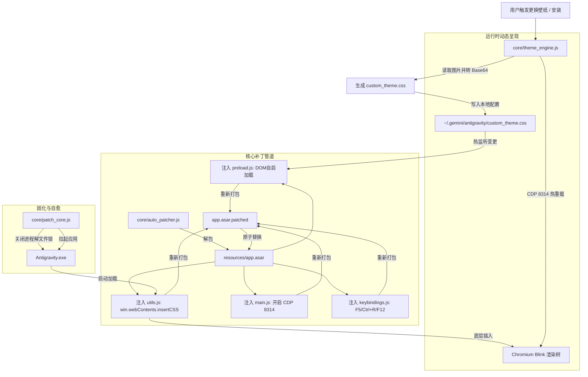

# 🏗️ Antigravity Theme Customizer 技术架构与原理解析

本文档详细阐述 Antigravity Theme Customizer 的底层注入原理、CSS 层叠构建时序以及 Electron 原生渲染管道设计。

---

## 1. 系统总体架构



---

## 2. 核心技术攻坚与实现

### 2.1 Chromium 原生 `insertCSS` 注入
- 早期通过外部脚本或简单的 Preload DOM 注入在页面深色模式切换或内部组件刷新时偶发闪烁。
- 采用 Electron 主进程的 `win.webContents.insertCSS(cssContent)` 在 `dom-ready` 和 `did-finish-load` 双生命周期钩子中直接注入 Blink 渲染引擎层，具有最高优先级且绝不闪退。

### 2.2 圣园未花发色柔光边界算法
- 摒弃了传统的全框卡片包围（那会导致内部终端和滚动条产生多余嵌套杂线）。
- 仅在中间活跃终端与右侧独立抽屉的左边界施加单侧边界线：
  ```css
  border-left: 1.5px solid rgba(249, 168, 212, 0.85) !important;
  box-shadow: 
    -1px 0 6px rgba(249, 168, 212, 0.75),
    -3px 0 14px rgba(244, 114, 182, 0.45),
    -6px 0 28px rgba(244, 114, 182, 0.22) !important;
  ```
- 配合未花发色十六进制调优，呈现呼吸感的霓虹流光。

### 2.3 极清曜石黑终端字体设计
- 传统二次元半透明终端的一大痛点是“文字反光看不清”。
- 本项目通过强化 XTerm / DOM 字符层：
  ```css
  .terminal .xterm-rows span {
    color: #0b0d10 !important;
    text-shadow: 0 0 2px rgba(255, 255, 255, 0.95), 0 0 5px rgba(255, 255, 255, 0.7) !important;
    font-weight: 600 !important;
  }
  ```
- 形成具有曜石般厚重质感的深黑字体，外围包裹纯白柔光，既保留背景人物画面的绝佳通透性，又保证写代码和看日志时清晰锐利。

---

## 3. 5 槽位层叠层级与穿透设计

| 槽位 | 作用元素选择器 | 渲染层级 (z-index) | 背景透明度 |
| :--- | :--- | :--- | :--- |
| **`左`** | `#root::before`, `html`, `body` | -999 (最底层全局垫底) | 100% 原始不透明度，全屏铺满 |
| **`中`** | `.terminal.xterm`, `div.relative.min-w-0.h-full` | 局部覆盖 | 70%~85% 局部半透，带左侧柔光粉边界 |
| **`右`** | `div.flex.flex-col.gap-2.overflow-y-auto.h-full.w-full.bg-background` | 局部覆盖 | 独立抽屉半透，带左侧柔光粉边界 |
| **`下`** | `div.flex.w-full.flex-col.rounded-2xl` (提问输入框) | 顶层悬浮 | 50% 磨砂毛玻璃 + 画中画底纹 |
| **`设置`** | `div[role="dialog"]`, 设置浮层 | 顶层模态窗 | 90% 通透磨砂，右上角专属立绘 |
